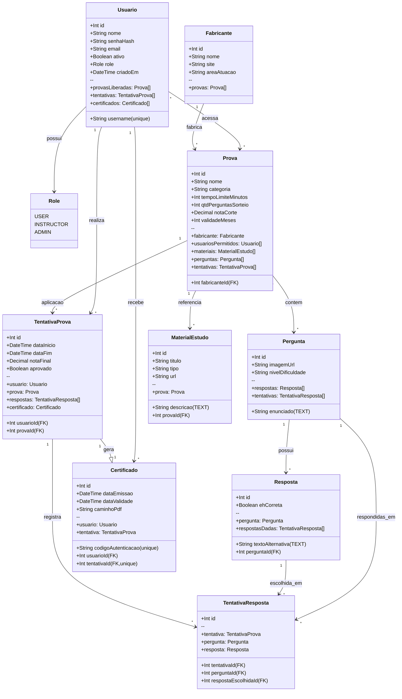

```mermaid
classDiagram
    class Usuario {
        +Int id
        +String nome
        +String username (unique)
        +String senhaHash
        +String email
        +Boolean ativo
        +Role role
        +DateTime criadoEm
        --
        +provasLiberadas: Prova[]
        +tentativas: TentativaProva[]
        +certificados: Certificado[]
    }

    class Role {
        USER
        INSTRUCTOR
        ADMIN
    }

    class Fabricante {
        +Int id
        +String nome
        +String site
        +String areaAtuacao
        --
        +provas: Prova[]
    }

    class Prova {
        +Int id
        +String nome
        +String categoria
        +Int tempoLimiteMinutos
        +Int qtdPerguntasSorteio
        +Decimal notaCorte
        +Int validadeMeses
        +Int fabricanteId(FK)
        --
        +fabricante: Fabricante
        +usuariosPermitidos: Usuario[]
        +materiais: MaterialEstudo[]
        +perguntas: Pergunta[]
        +tentativas: TentativaProva[]
    }

    class Pergunta {
        +Int id
        +String enunciado (TEXT)
        +String imagemUrl
        +String nivelDificuldade
        --
        +respostas: Resposta[]
        +tentativas: TentativaResposta[]
    }

    class Resposta {
        +Int id
        +String textoAlternativa (TEXT)
        +Boolean ehCorreta
        +Int perguntaId (FK)
        --
        +pergunta: Pergunta
        +respostasDadas: TentativaResposta[]
    }

    class TentativaProva {
        +Int id
        +DateTime dataInicio
        +DateTime dataFim
        +Decimal notaFinal
        +Boolean aprovado
        +Int usuarioId (FK)
        +Int provaId (FK)
        --
        +usuario: Usuario
        +prova: Prova
        +respostas: TentativaResposta[]
        +certificado: Certificado
    }

    class TentativaResposta {
        +Int id
        +Int tentativaId (FK)
        +Int perguntaId (FK)
        +Int respostaEscolhidaId (FK)
        --
        +tentativa: TentativaProva
        +pergunta: Pergunta
        +resposta: Resposta
    }

    class Certificado {
        +Int id
        +String codigoAutenticacao (unique)
        +DateTime dataEmissao
        +DateTime dataValidade
        +String caminhoPdf
        +Int usuarioId (FK)
        +Int tentativaId (FK,unique)
        --
        +usuario: Usuario
        +tentativa: TentativaProva
    }

    class MaterialEstudo {
        +Int id
        +String titulo
        +String descricao (TEXT)
        +String tipo
        +String url
        +Int provaId (FK)
        --
        +prova: Prova
    }

    Usuario "1" --> "*" TentativaProva : realiza
    Usuario "1" --> "*" Certificado : recebe
    Usuario "*" --> "*" Prova : acessa
    
    Fabricante "1" --> "*" Prova : fabrica
    
    Prova "1" --> "*" Pergunta : contem
    Prova "1" --> "*" TentativaProva : aplicacao
    Prova "1" --> "*" MaterialEstudo : referencia
    
    Pergunta "1" --> "*" Resposta : possui
    Pergunta "1" --> "*" TentativaResposta : respondidas_em
    
    Resposta "1" --> "*" TentativaResposta : escolhida_em
    
    TentativaProva "1" --> "*" TentativaResposta : registra
    TentativaProva "1" --|> "1" Certificado : gera
    
    Usuario --> Role : possui
```
