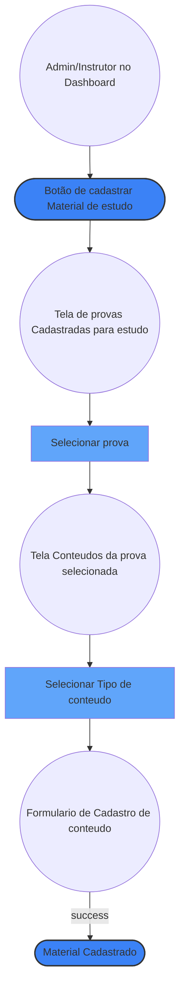

```mermaid
flowchart TD;

dashboard((Admin/Instrutor no Dashboard))
DashProvas((Tela de provas Cadastradas para estudo))

NovoMaterial(["Botão de cadastrar Material de estudo"])
style NovoMaterial fill:#3b82f6,stroke:#333,stroke-width:2px

ProvaForm[Selecionar prova]
style ProvaForm fill:#60a5fa

DashConteudoProva((Tela Conteudos da prova selecionada))

ConteudoTipo[Selecionar Tipo de conteudo]
style ConteudoTipo fill:#60a5fa

CasdastrarConteudo(("Formulario de Cadastro de conteudo"))

MaterialCadastro(["Material Cadastrado"])
style MaterialCadastro fill:#3b82f6,stroke:#333,stroke-width:2px

dashboard-->NovoMaterial
NovoMaterial-->DashProvas
DashProvas-->ProvaForm
ProvaForm-->DashConteudoProva
DashConteudoProva-->ConteudoTipo
ConteudoTipo-->CasdastrarConteudo
CasdastrarConteudo-->|success|MaterialCadastro
```
