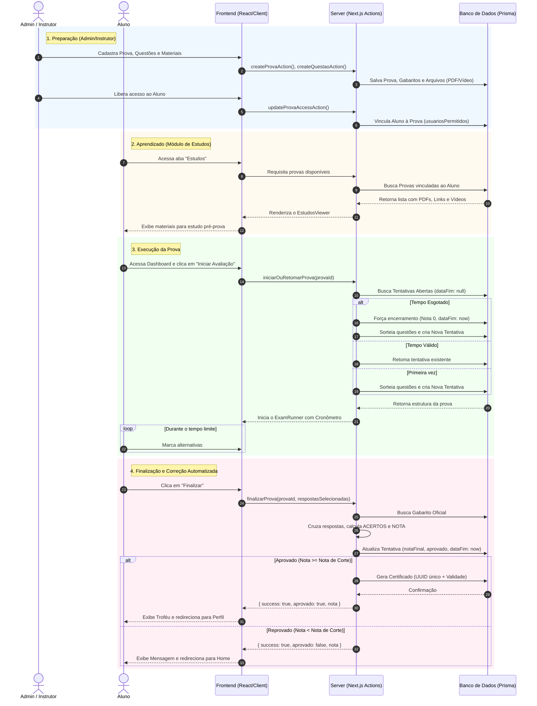

```mermaid
sequenceDiagram
    autonumber
    actor Admin as Admin / Instrutor
    actor Aluno as Aluno
    participant UI as Frontend (React/Client)
    participant API as Server (Next.js Actions)
    participant DB as Banco de Dados (Prisma)

    rect rgb(240, 248, 255)
        note right of Admin: 1. Preparação (Admin/Instrutor)
        Admin->>UI: Cadastra Prova, Questões e Materiais
        UI->>API: createProvaAction(), createQuestaoAction()
        API->>DB: Salva Prova, Gabaritos e Arquivos (PDF/Vídeo)
        Admin->>UI: Libera acesso ao Aluno
        UI->>API: updateProvaAccessAction()
        API->>DB: Vincula Aluno à Prova (usuariosPermitidos)
    end

    rect rgb(255, 250, 240)
        note right of Aluno: 2. Aprendizado (Módulo de Estudos)
        Aluno->>UI: Acessa aba "Estudos"
        UI->>API: Requisita provas disponíveis
        API->>DB: Busca Provas vinculadas ao Aluno
        DB-->>API: Retorna lista com PDFs, Links e Vídeos
        API-->>UI: Renderiza o EstudosViewer
        UI-->>Aluno: Exibe materiais para estudo pré-prova
    end

    rect rgb(240, 255, 240)
        note right of Aluno: 3. Execução da Prova
        Aluno->>UI: Acessa Dashboard e clica em "Iniciar Avaliação"
        UI->>API: iniciarOuRetomarProva(provaId)
        
        API->>DB: Busca Tentativas Abertas (dataFim: null)
        alt Tempo Esgotado 
            API->>DB: Força encerramento (Nota 0, dataFim: now)
            API->>DB: Sorteia questões e cria Nova Tentativa
        else Tempo Válido
            API->>DB: Retoma tentativa existente
        else Primeira vez
            API->>DB: Sorteia questões e cria Nova Tentativa
        end
        
        DB-->>API: Retorna estrutura da prova 
        API-->>UI: Inicia o ExamRunner com Cronômetro
        
        loop Durante o tempo limite
            Aluno->>UI: Marca alternativas
        end
    end

    rect rgb(255, 240, 245)
        note right of Aluno: 4. Finalização e Correção Automatizada
        Aluno->>UI: Clica em "Finalizar"
        UI->>API: finalizarProva(provaId, respostasSelecionadas)
        API->>DB: Busca Gabarito Oficial
        API->>API: Cruza respostas, calcula ACERTOS e NOTA
        API->>DB: Atualiza Tentativa (notaFinal, aprovado, dataFim: now)
        
        alt Aprovado (Nota >= Nota de Corte)
            API->>DB: Gera Certificado (UUID único + Validade)
            DB-->>API: Confirmação
            API-->>UI: { success: true, aprovado: true, nota }
            UI-->>Aluno:  Exibe Troféu e redireciona para Perfil
        else Reprovado (Nota < Nota de Corte)
            API-->>UI: { success: true, aprovado: false, nota }
            UI-->>Aluno: Exibe Mensagem e redireciona para Home
        end
    end
```