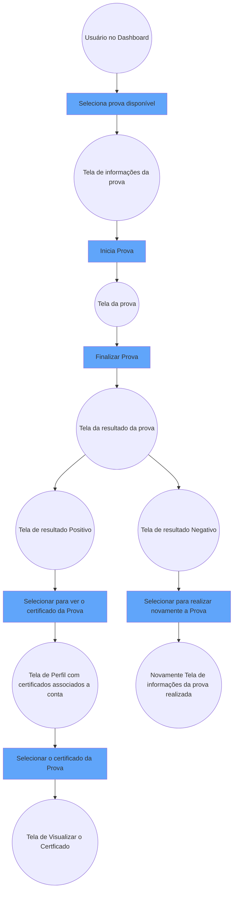

```mermaid
flowchart TD;

dashboard((Usuário no Dashboard))

SelecionarProva[Seleciona prova disponível]
style SelecionarProva fill:#60a5fa

DashPreProva((Tela de informações da prova))

BotaoInicarProva[Inicia Prova]
style BotaoInicarProva fill:#60a5fa

DashProva((Tela da prova))

BotaoFinalizarProva[Finalizar Prova]
style BotaoFinalizarProva fill:#60a5fa

DashResultado((Tela da resultado da prova))

DashResultadoPositivo((Tela de resultado Positivo))
BotaoVerCertificado[Selecionar para ver o certificado da Prova]
style BotaoVerCertificado fill:#60a5fa
DashPerfil((Tela de Perfil com certificados associados a conta))
BotaoSelecionarCertificado[Selecionar o certificado da Prova]
style BotaoSelecionarCertificado fill:#60a5fa
DashCertificado((Tela de Visualizar o Certficado))


DashResultadoNegativo((Tela de resultado Negativo ))
BotaoRefazerProva[Selecionar para realizar novamente a Prova]
style BotaoRefazerProva fill:#60a5fa
DashPreProva2((Novamente Tela de informações da prova realizada))

dashboard-->SelecionarProva
SelecionarProva-->DashPreProva
DashPreProva-->BotaoInicarProva
BotaoInicarProva-->DashProva
DashProva-->BotaoFinalizarProva
BotaoFinalizarProva-->DashResultado

DashResultado-->DashResultadoNegativo
DashResultadoNegativo-->BotaoRefazerProva
BotaoRefazerProva-->DashPreProva2

DashResultado-->DashResultadoPositivo
DashResultadoPositivo-->BotaoVerCertificado
BotaoVerCertificado-->DashPerfil
DashPerfil-->BotaoSelecionarCertificado
BotaoSelecionarCertificado-->DashCertificado
```
