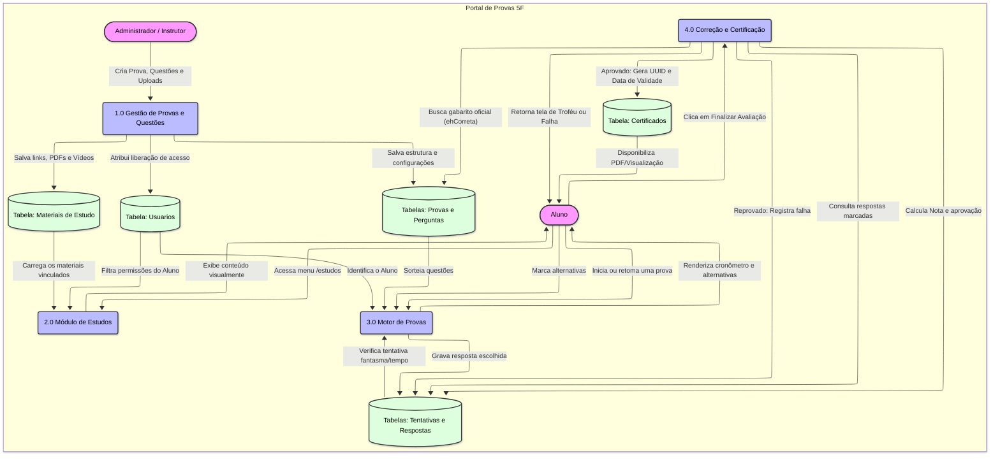

```mermaid
---
config:
  look: neo
  layout: elk
---
graph TD
    subgraph "Portal de Provas 5F"
    classDef ator fill:#f9f,stroke:#333,stroke-width:2px,color:#000
    classDef processo fill:#bbf,stroke:#333,stroke-width:2px,color:#000
    classDef banco fill:#dfd,stroke:#333,stroke-width:2px,color:#000

    Admin([Administrador / Instrutor]):::ator
    Aluno([Aluno]):::ator

    P1(1.0 Gestão de Provas e Questões):::processo
    P2(2.0 Módulo de Estudos):::processo
    P3(3.0 Motor de Provas):::processo
    P4(4.0 Correção e Certificação):::processo

    D1[(Tabela: Usuarios)]:::banco
    D2[(Tabelas: Provas e Perguntas)]:::banco
    D3[(Tabela: Materiais de Estudo)]:::banco
    D4[(Tabelas: Tentativas e Respostas)]:::banco
    D5[(Tabela: Certificados)]:::banco

    Admin -- "Cria Prova, Questões e Uploads" --> P1
    P1 -- "Salva estrutura e configurações" --> D2
    P1 -- "Salva links, PDFs e Vídeos" --> D3
    P1 -- "Atribui liberação de acesso" --> D1

    Aluno -- "Acessa menu /estudos" --> P2
    D1 -- "Filtra permissões do Aluno" --> P2
    D3 -- "Carrega os materiais vinculados" --> P2
    P2 -- "Exibe conteúdo visualmente" --> Aluno

    Aluno -- "Inicia ou retoma uma prova" --> P3
    D1 -- "Identifica o Aluno" --> P3
    D4 -- "Verifica tentativa fantasma/tempo" --> P3
    D2 -- "Sorteia questões" --> P3
    P3 -- "Renderiza cronômetro e alternativas" --> Aluno
    
    Aluno -- "Marca alternativas" --> P3
    P3 -- "Grava resposta escolhida" --> D4

    Aluno -- "Clica em Finalizar Avaliação" --> P4
    P4 -- "Consulta respostas marcadas" --> D4
    P4 -- "Busca gabarito oficial (ehCorreta)" --> D2
    P4 -- "Calcula Nota e aprovação" --> D4
    
    P4 -- "Aprovado: Gera UUID e Data de Validade" --> D5
    D5 -- "Disponibiliza PDF/Visualização" --> Aluno
    P4 -- "Reprovado: Registra falha" --> D4
    P4 -- "Retorna tela de Troféu ou Falha" --> Aluno
    end
```