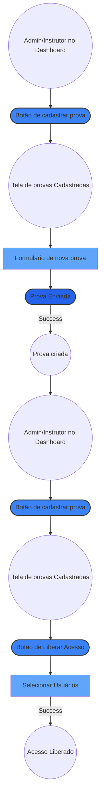

```mermaid
flowchart TD;

dashboard((Admin/Instrutor no Dashboard))
DashProvas((Tela de provas Cadastradas))

NovaProva(["Botão de cadastrar prova"])
style NovaProva fill:#3b82f6,stroke:#333,stroke-width:2px

ProvaForm[Formulario de nova prova]
style ProvaForm fill:#60a5fa

EnviarProva([Prova Enviada])
style EnviarProva fill:#2563eb,stroke:#333,stroke-width:2px

ProvaCriada((Prova criada))
dashboard2((Admin/Instrutor no Dashboard))

NovaProva2(["Botão de cadastrar prova"])
style NovaProva2 fill:#3b82f6,stroke:#333,stroke-width:2px

DashProvas2((Tela de provas Cadastradas))

BotaoAcesso(["Botão de Liberar Acesso"])
style BotaoAcesso fill:#3b82f6,stroke:#333,stroke-width:2px

SelecionarUsers[Selecionar Usuários]
style SelecionarUsers fill:#60a5fa 

AcessoLiberado((Acesso Liberado))


dashboard-->NovaProva
NovaProva-->DashProvas
DashProvas-->ProvaForm

ProvaForm-->EnviarProva
EnviarProva-->|Success|ProvaCriada
ProvaCriada-->dashboard2
dashboard2-->NovaProva2
NovaProva2-->DashProvas2
DashProvas2-->BotaoAcesso
BotaoAcesso-->SelecionarUsers
SelecionarUsers-->|Success|AcessoLiberado
```