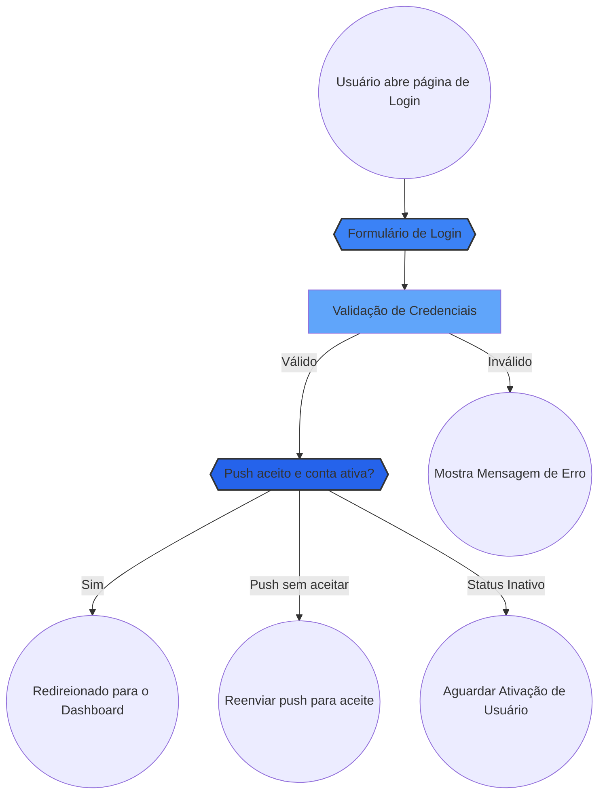

```mermaid
flowchart TD;

start((Usuário abre página de Login))

form{{Formulário de Login}}
style form fill:#3b82f6,stroke:#333,stroke-width:2px

validate[Validação de Credenciais]
style validate fill:#60a5fa

verify{{Push aceito e conta ativa?}}
style verify fill:#2563eb,stroke:#333,stroke-width:2px

success((Redireionado para o Dashboard))
fail((Mostra Mensagem de Erro))
verifyEmail((Reenviar push para aceite))
VerifyStatus((Aguardar Ativação de Usuário))

start-->form
form-->validate
validate-->|Válido|verify
validate-->|Inválido|fail
verify-->|Sim|success
verify-->|Push sem aceitar|verifyEmail
verify--> |Status Inativo|VerifyStatus
```